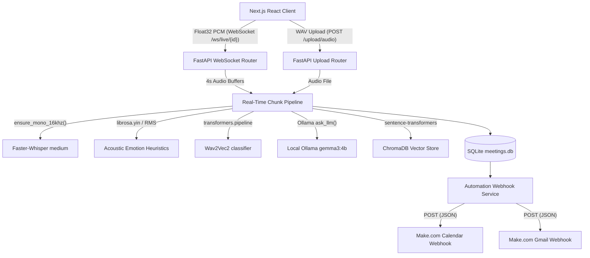

# Real-Time Meeting Intelligence Platform

This repository contains the backend and frontend services of a real-time meeting transcription, emotion analysis, and action-item extraction platform. The system operates locally to process live speaker audio streams or uploaded audio files, compile structured meeting minutes, index content for semantic search, and dispatch webhook automations.

---

## 1. System Architecture

The platform is split into a **FastAPI backend** and a **Next.js frontend**. 



### Technical Design Rationale
* **Local CPU Compatibility**: Speech recognition (Faster-Whisper), speaker diarization (pyannote.audio), embeddings (SentenceTransformers), and raw emotion extraction (Wav2Vec2) are locked to CPU deployment. The local LLM uses Ollama (`gemma3:4b`) to keep RAM bounds under 16GB.
* **Concurrent SQLite WAL Mode**: Write-Ahead Logging (WAL) and a 10.0s lock timeout are enabled to support concurrent read operations (e.g. frontend live Q&A polling) and background write operations (e.g. websocket transcription updates).
* **Asynchronous Webhook Threading**: External API calls to Make.com are spawned in separate daemon threads so that network latencies or webhook failures do not block or crash transcription loops.

---

## 2. Processing Pipelines

### 2.1 Live Transcription & Processing Pipeline
1. **Audio Streaming**: The frontend captures speaker microphone input via the Web Audio API and streams raw Float32 mono PCM data over a WebSocket to `/ws/live/{meeting_id}`.
2. **Chunk Accumulation**: The server accumulates packets until it collects a 4-second chunk (64,000 samples at 16kHz). It applies a peak normalization scaler to avoid clipping and writes a temporary WAV file.
3. **Rolling Overlap**: To prevent word truncation at chunk boundaries, a 1.5-second rolling overlap is kept between consecutive chunks.
4. **Whisper Transcription**: The chunk is transcribed using a `faster-whisper` `medium` model on CPU. Voice Activity Detection (VAD) is turned on to filter silence (`vad_filter=True`, `min_silence_duration_ms=500`).
5. **Deduplication**: Segment timestamps are mapped to the absolute meeting timeline. Segment overlap is filtered out using a `0.2s` alignment tolerance relative to `last_max_end_time`.
6. **Background Intelligence**: If a segment text is $\ge 8$ words, the server immediately stores a placeholder in SQLite and triggers `process_chunk_intelligence` in a background thread to update metadata asynchronously.

```
Buffer:  [ === Chunk 0 (4s) === ]
Slide:           [ === Chunk 1 (4s) === ]  --> 1.5s Overlap
Timeline: 0s ------------- 4s ------------- 6.5s
```

### 2.2 Emotion Analysis Pipeline
* **Wav2Vec2 Classification**: The primary pipeline feeds the mono 16kHz audio chunk into `superb/wav2vec2-base-superb-er` to classify emotion (`Neutral`, `Excited`, `Worried`, `Angry`).
* **Acoustic Heuristics Fallback**: If the pipeline fails to load or run on CPU, it falls back to Librosa feature engineering. It computes Root-Mean-Square (RMS) energy, Zero-Crossing Rate (ZCR), pitch tracking (Yin algorithm), pause ratio, and speech rate to classify tone dynamically.
* **LLM Context Refinement**: For speech segments $\ge 8$ words, the local LLM combines the acoustic classification with semantic transcript context. It refines the final emotion label (incorporating labels like `Frustrated` or `Hesitant`), extracts a confidence score, and provides a short explanation.

### 2.3 Periodic Tasks (Speaker Diarization & Summary)
* **Diarization**: Every 16 seconds of live audio, the server runs a background pyannote `speaker-diarization-3.1` pass over the accumulated session WAV file. Spoken segments are matched to speaker labels (`Speaker_00`, `Speaker_01`) using a midpoint overlap heuristic.
* **Incremental Summaries**: Every 30 seconds of audio, the server aggregates the recent transcript segments and sentiment scores to update a professional running summary, incorporating participant observations and dominant emotion trends.

### 2.4 Live Q&A and Memory Search Pipeline
* **Live Q&A**: Employs backward iteration over transcript segments. The system works backward from the most recent speech segment up to a limit of 5,000 characters. This constructs a chronological recent transcript context, allowing the LLM to answer questions about the active session in real-time.
* **RAG Memory Search**: General queries about historical meetings are processed by `/search/memory`. The LLM translates the query into a JSON plan containing:
  1. SQL queries against SQLite (`meetings`, `tasks`, `decisions`, `speakers` tables).
  2. A semantic query against ChromaDB.
  Results are capped, enriched, truncated to 5,000 characters, and synthesized into a concise answer.

---

## 3. Automation & Webhook Integrations

Integrations with Make.com act as the communication layer for external services.

```
                      [Meeting Processing Pipeline]
                                   |
            -------------------------------------------------
            |                                               |
[Event Extracted (Live/Upload)]               [Meeting Finalized (status='done')]
            |                                               |
process_and_trigger_calendar_event()          trigger_meeting_summary_automation()
            |                                               |
    * Check SQLite duplicate                        * Fetch summary, tasks, decisions
    * Resolve relative dates                        * Format payload
    * Generate ICS file                                     |
            |                                               v
            v                                     POST to MAKE_GMAIL_WEBHOOK_URL
POST to MAKE_CALENDAR_WEBHOOK_URL
```

### 3.1 Google Calendar Webhook Flow
* **Extraction**: During processing, the LLM extracts scheduled events containing `title`, `date`, `start_time`, `end_time`, and `attendees`.
* **Resolution**: The backend resolves relative dates (e.g. "next Friday", "tomorrow") against the current system date using `dateparser` and weekday offset math. It default-allocates a 60-minute duration if the end time is missing.
* **Deduplication**: Prior to triggering the webhook, the database is queried to ensure that an event with the same `meeting_id`, `title`, `event_date`, and `event_time` does not already exist.
* **Dispatch**: The event is recorded in the `calendar_events` table, an `.ics` file is generated, and a background request is dispatched to `MAKE_CALENDAR_WEBHOOK_URL` containing:
  ```json
  {
    "type": "event",
    "meeting_id": 999,
    "title": "Weekly Sync",
    "date": "2026-06-26",
    "start_time": "15:00",
    "end_time": "16:00",
    "attendees": ["user@example.com"]
  }
  ```

### 3.2 Gmail / Meeting Summary Webhook Flow
* **Trigger**: Fired when a meeting status transitions to `'done'` (upon live meeting disconnect or file upload pipeline completion).
* **Payload Construction**: Retrieves the summary, tasks, decisions, and calendar events from the database. It constructs and POSTs a payload to `MAKE_GMAIL_WEBHOOK_URL` containing:
  ```json
  {
    "type": "summary",
    "meeting_id": 999,
    "title": "Budget Review",
    "summary": "This meeting finalized integration parameters...",
    "tasks": [{"task": "Deploy updates", "owner": "Rahul", "deadline": "2026-06-20", "status": "Pending"}],
    "decisions": ["Approved webhook payload structures."],
    "events": [{"title": "Review Event", "date": "2026-06-25", "start_time": "15:00", "end_time": "16:00", "attendees": ["user@example.com"]}],
    "generated_at": "2026-06-17T20:00:00Z"
  }
  ```
* **Audit Trail**: Every attempt is saved in the `automation_logs` table. Webhook status code results (`200`, `500`) are stored for diagnostic checks. Webhook failures do not impact or block core database operations.
